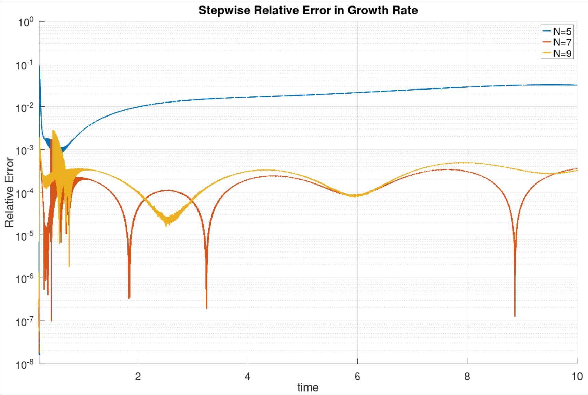
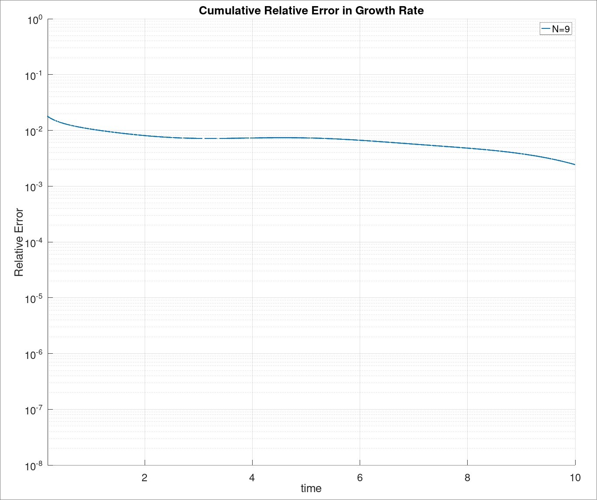

# Inductionless MHD linear instability in square duct flow with conducting wall
Flow is along the z direction and periodic in z.

Fluid domain is [-1, 1] x [-1, 1] x [0, 2pi/alpha] where alpha is the wave number.

Reference paper: [Priede2016](https://doi.org/10.1017/jfm.2015.709)


## Running the case
### Solve eigenmode
```
octave os_square.m
```
or
```
matlab -batch "run('os_square.m')"
```
to solve the eigenmode. This will also output `u_base0.f00001`, `u_real0.f00001`, and `u_imag0.f00001`, which will be read into NekRS to initiate the flow.

Make sure that there is only one unstable eigenmode, and put all the solved parameters into `nekrs/channel.par`. The parameters are 
`viscosity`, `sigma`, `sigmaSolid`, `P_FZ`, `P_GAMMA_R`, `P_GAMMA_I`, `P_ALPHA`. `FZ`, the body acceleration in z, is calculated so that the 
base velocity has a maximum value of `1.0`.

Then copy the mode files into `nekrs`
```
cp u_base0.f00001 nekrs/
cp u_real0.f00001 nekrs/
cp u_imag0.f00001 nekrs/
```

### Make mesh
Make sure you have `prenek`, `reatore2`, and `genbox`
```
cd nekrs/mesh
./mkmsh
cp out.rea ../channel.rea
cp out.re2 ../channel.re2
```

### Run NekRS
```
cd nekrs
nrsbmpi channel 2
```
The growth rate is calculated from x-velocity.

The error is output in the logfile as 
`tstep=19998 time=9.999 vy2=2.34515e-07 gl=0.0188405 gr=0.0185596 gle=0.0126654 ge=0.0024325 AMP`
where `gl` and `gr` are the stepwise and cumulative growth rate respectively.
`gle` and `ge` are the relative error of stepwise and cumulative growth rate from the linear stability growth rate.


## Result
### Ha = 15
```
N = 20
Re = 1e4;
Ha = 15;
c = 1.0;
W = 0.1;
alpha = 1.0;

meshVel  = [-1.0, 1.0];
meshWall = [0.0, 1.0]*W + 1.0;
```
The only unstable eigenvalue is `gamma = 0.00604853617 - 0.89997283133i`


### Ha = 100
```
N = 15
Re = 1e4;
Ha = 15;
c = 1.0;
W = 0.1;
alpha = 1.0;

meshVel  = [-1.0, -0.8, -0.4, 0.0, 0.4, 0.8, 1.0];
meshWall = [0.0, 1.0]*W + 1.0;
```
The only unstable eigenvalue is `gamma = 0.0186048180 - 0.7790663688i`


